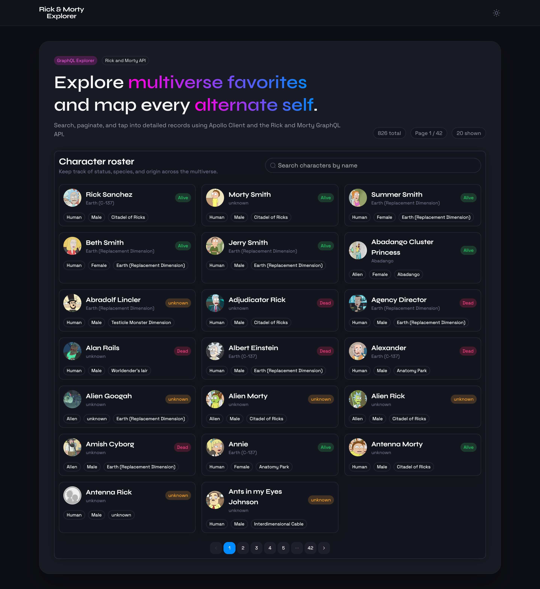
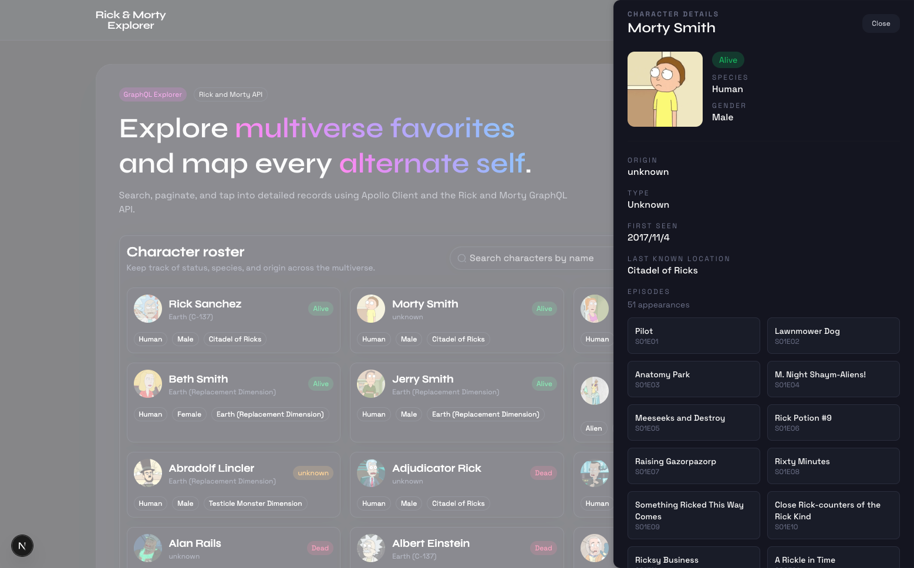
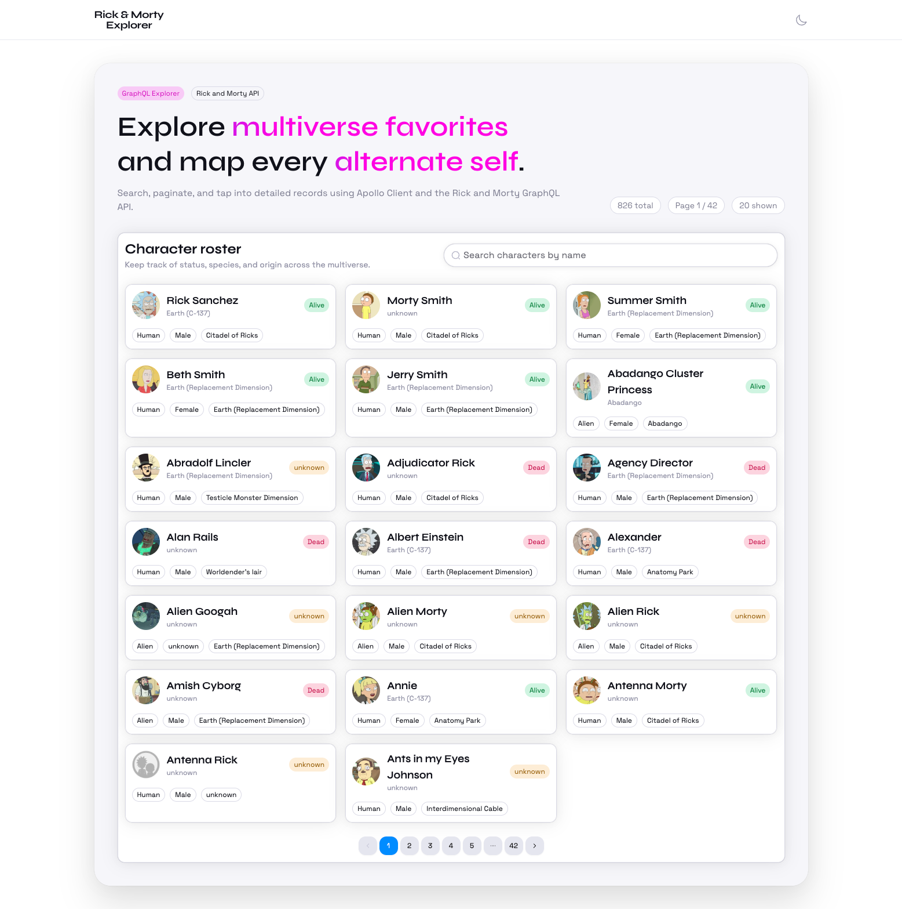
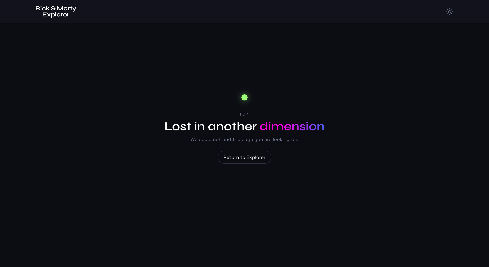

# 🚀🧪 Rick & Morty Explorer

A responsive Rick and Morty character explorer with search, pagination, and a detail drawer, designed with a subtle cyber aesthetic inspired by _Cyberr_.

**Demo:** [https://rick-and-morty-explorer-ochre.vercel.app/](https://rick-and-morty-explorer-ochre.vercel.app/)

## 🧰 Tech Stack

- Next.js (App Router)
- TypeScript
- Apollo Client
- GraphQL (Rick and Morty API)
- Tailwind CSS
- HeroUI
- next-themes

## ✨ Features

- Search characters by name with debounced input
- Paginated character list with next/previous navigation
- Detail drawer for quick access to character information
- Shareable URL state via query string (`q`, `page`, `id`)
- Cyberr-inspired, minimalist visual styling
- Light/Dark theme toggle
- Responsive layout for desktop and mobile

**Notes**

- Long names/text are clamped so cards stay tidy.
- Character images use a fallback placeholder when missing/broken.
- ARIA labels + keyboard support are wired for search, pagination, and the drawer.

## 🖼️ Screenshots

- **Homepage** — Main explorer view with search, filters, and pagination.

  

- **Character drawer** — Slide-over detail panel with status, origin, and episodes.

  

- **Light theme** — Default light theme.

  

- **404 page** — Not-found state with styling.

  

## ⚙️ Getting Started

### Setup

```bash
npm install
```

### Run

```bash
npm run dev
```

Open `http://localhost:3000` in your browser.

### Testing

- Install browsers (one-time):

```bash
npx playwright install
```

- Run end-to-end tests:

```bash
npm run test:e2e
```

## 📡 GraphQL

- Schema/types are generated by `npm run codegen` (wired into `predev`/`prebuild`, so you rarely run it manually). Output: `__generated__/graphql.ts`.
- Queries live in `graphql/`:
  - `characterById.query.graphql` → `CHARACTER_BY_ID_QUERY` for the drawer.
  - (Character list query lives in `__generated__` via `CharactersDocument`/`CHARACTERS_QUERY`.)
- Components use typed hooks: `ExplorerPage` (`useQuery<CharactersQuery, CharactersQueryVariables>`) and `CharacterDrawer` (`useQuery<CharacterByIdQuery, CharacterByIdQueryVariables>`).

## 🧠 Assumptions

- The Rick and Morty GraphQL API is stable, publicly accessible, and does not require authentication.
- The dataset changes infrequently, making SSR of the initial page valuable for SEO and perceived performance.
- Client-side pagination and filtering are sufficient given the expected data size and traffic.

## ⚖️ Tradeoffs

- Query string state enables shareable URLs and back/forward navigation but requires extra routing logic (syncing input, pagination, and selection) and more frequent URL updates.
- SSR is intentionally limited to the initial page to improve SEO and first paint while keeping filtering and pagination fully client-side for responsiveness.
- Combining SSR and CSR improves the initial user experience but increases complexity around cache hydration and state consistency.

## 🔮 Possible Improvements

- Extend SSR to support the first page with an active search query if SEO for search results becomes a priority.
- Enhance caching strategies, such as prefetching the next page or fine-tuning cache policies.
- Improve empty and error states with clearer messaging and retry actions.
- Extract icons into a shared icon system or adopt a dedicated icon library for better consistency and maintainability.
- Add lightweight analytics to track empty results, errors, and user interaction patterns.

## 📝 Project Notes

### Time Spent

Approximately 7 hours over 2 days.

### Time Breakdown

- Initial setup (HeroUI template, Apollo Client, Tailwind CSS) — ~1.5h
- Feature implementation and component work (search, pagination, drawer) — ~3h
- SSR for initial load — ~1h
- README documentation — ~0.5h
- Testing setup and coverage — ~1h
